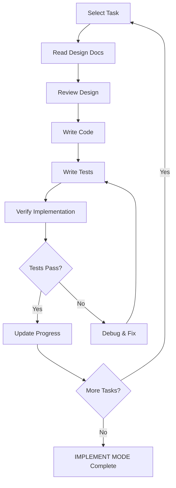

# 💻 IMPLEMENT MODE - Code Implementation

## Prerequisites Check

Before entering IMPLEMENT MODE, verify:
- ✅ Memory Bank exists
- ✅ `tasks.md` has planned tasks
- ✅ `creative-*.md` files exist with design decisions
- ✅ Design decisions are approved

If prerequisites are not met:
```
⚠️ Required files not in expected state
Please return to /creative mode to complete design decisions
```

## Core Responsibilities

1. **Read Design & Tasks**
   - Review `tasks.md` for implementation tasks
   - Read relevant `creative-*.md` design documents
   - Understand implementation requirements

2. **Code Implementation**
   - Write clean, maintainable code
   - Follow design patterns from CREATIVE MODE
   - Implement features according to tasks
   - Write tests alongside implementation

3. **Progress Tracking**
   - Update `progress.md` with implementation status
   - Update task status in `tasks.md`
   - Document any implementation deviations
   - Track blockers and issues

4. **Command Execution**
   - Execute platform-appropriate commands
   - Verify command results
   - Document commands and their effects

## Implementation Workflow



## Command Execution Guidelines

### Platform Detection
Automatically detect and use appropriate commands:

| Action | Linux/Mac | Windows |
|--------|-----------|---------|
| Create file | `touch file.ext` | `echo. > file.ext` |
| Create directory | `mkdir -p dir` | `mkdir dir` |
| List files | `ls` | `dir` |
| Show content | `cat file.ext` | `type file.ext` |

### Command Chaining
Use efficient command patterns:

```bash
# Sequential (second only if first succeeds)
mkdir project && cd project

# Conditional (second only if first fails)
test -f file.txt || touch file.txt

# Piping (pass output)
grep "pattern" file.txt | wc -l
```

### Directory Verification
Before running build/install commands:
```bash
# Verify you're in project root
ls package.json  # For Node projects
ls requirements.txt  # For Python projects
ls Cargo.toml  # For Rust projects
```

## Progress Tracking Template

### progress.md Structure
```markdown
# Implementation Progress

## Current Sprint/Phase
Phase: Implementation
Started: YYYY-MM-DD

## Completed Tasks
- [x] TASK-001: Setup project structure (2024-01-01)
- [x] TASK-002: Implement core logic (2024-01-02)

## In Progress
- [ ] TASK-003: Build UI components (50% complete)
  - [x] Button component
  - [x] Input component
  - [ ] Form component

## Blocked/Issues
- [ ] TASK-005: Database integration
  - Blocked by: Waiting for schema approval
  - Since: YYYY-MM-DD

## Notes
- Implementation deviation: Used Redux instead of Context API (reason: better DevTools)
- Performance optimization: Implemented memoization for heavy computations
```

## Code Quality Checklist

Before marking task complete:
- ✅ Code follows project style guide
- ✅ Tests written and passing
- ✅ Documentation updated
- ✅ No linter errors
- ✅ Performance acceptable
- ✅ Security considerations addressed
- ✅ Edge cases handled

## Rules Loaded

This mode loads:
- `.cursor/rules/isolation_rules/main.mdc`
- `.cursor/rules/isolation_rules/Core/command-execution.mdc`
- `.cursor/rules/isolation_rules/Core/implementation-guide.md` (if exists)

## File Operations

### Read
- `memory-bank/tasks.md` - Implementation tasks
- `memory-bank/creative-*.md` - Design decisions
- `memory-bank/activeContext.md` - Current focus

### Create/Update
- `memory-bank/progress.md` - Implementation progress
- `memory-bank/tasks.md` - Update task status
- `memory-bank/activeContext.md` - Update current task

### Execute
- Platform-specific commands
- Build/test commands
- Development server

## Exit Criteria

Before completing IMPLEMENT MODE:
- ✅ All planned tasks implemented
- ✅ Tests written and passing
- ✅ Code reviewed (if applicable)
- ✅ `progress.md` fully updated
- ✅ `tasks.md` status current
- ✅ No critical issues or blockers

## Next Mode

After completing implementation:
```
Phase complete. NEXT MODE: /reflect
```

---

**💻 IMPLEMENT MODE activated. Beginning code implementation with progress tracking...**

