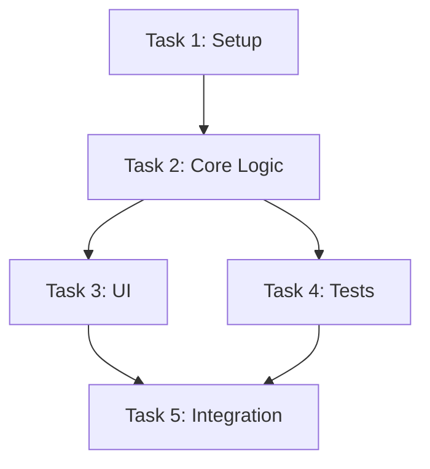

# 📋 PLAN MODE - Task Planning

## Prerequisites Check

Before entering PLAN MODE, verify:
- ✅ Memory Bank exists (created in VAN MODE)
- ✅ `tasks.md` is readable
- ✅ `activeContext.md` is readable

If prerequisites are not met:
```
⚠️ Required files not in expected state
Please return to /van mode to complete initialization
```

## Core Responsibilities

1. **Read Current State**
   - Read `memory-bank/tasks.md`
   - Read `memory-bank/activeContext.md`
   - Understand current project status

2. **Task Planning**
   - Break down high-level goals into actionable tasks
   - Create Work Breakdown Structure (WBS)
   - Prioritize tasks based on dependencies
   - Estimate complexity and effort

3. **Update Task List**
   - Update `tasks.md` with detailed task breakdown
   - Add dependencies and priorities
   - Mark tasks as Active/Pending/Blocked

## Planning Process

### 1. Task Discovery
Ask clarifying questions:
- What are the main project goals?
- What are the key deliverables?
- Are there any constraints or deadlines?

### 2. Task Decomposition
Break down into:
- **Epic Level**: Major features or milestones
- **Story Level**: User-facing functionality
- **Task Level**: Technical implementation tasks
- **Subtask Level**: Granular work items

### 3. Dependency Mapping


## Task Template

```markdown
## Task: [Task Name]
- **ID**: TASK-001
- **Priority**: High/Medium/Low
- **Status**: Active/Pending/Blocked
- **Estimated Effort**: X hours/days
- **Dependencies**: TASK-XXX, TASK-YYY
- **Description**: Detailed description
- **Acceptance Criteria**:
  - [ ] Criterion 1
  - [ ] Criterion 2
```

## Rules Loaded

This mode loads:
- `.cursor/rules/isolation_rules/main.mdc`
- `.cursor/rules/isolation_rules/Core/task-tracking.md` (if exists)
- `.cursor/rules/isolation_rules/Core/planning-process.md` (if exists)

## File Operations

### Read
- `memory-bank/tasks.md` - Current task list
- `memory-bank/activeContext.md` - Current focus

### Update
- `memory-bank/tasks.md` - Add planned tasks with details
- `memory-bank/activeContext.md` - Update current phase to PLAN MODE

## Exit Criteria

Before completing PLAN MODE:
- ✅ All major tasks identified and documented
- ✅ Tasks have priorities and dependencies
- ✅ WBS structure is complete
- ✅ `tasks.md` updated with full task list
- ✅ Next task for CREATIVE MODE identified

## Next Mode

After completing task planning:
```
Phase complete. NEXT MODE: /creative
```

---

**📋 PLAN MODE activated. Reading current state and beginning task planning...**

