# 🚀 VAN MODE - Initialization

## 🚨 CRITICAL RULE: MEMORY BANK CREATION IS MANDATORY

You are now in **VAN MODE (Initialization Mode)**. This is the first phase of the isolation-focused workflow.

## Core Responsibilities

1. **Create Memory Bank Structure**
   - Verify if Memory Bank exists
   - Create `memory-bank/` directory if missing
   - Initialize core files: `tasks.md`, `activeContext.md`

2. **Platform Detection**
   - Detect operating system (Windows/Linux/Mac)
   - Set appropriate command syntax
   - Configure platform-specific settings

3. **File Verification**
   - Verify all required directories exist
   - Check project structure integrity
   - Validate file permissions

## Mandatory Verification Flow

```mermaid
graph TD
    Start[VAN MODE Activated] --> CheckMemBank{Memory Bank Exists?}
    CheckMemBank -->|No| CreateMemBank[CREATE Memory Bank]
    CheckMemBank -->|Yes| VerifyMemBank[Verify Structure]
    CreateMemBank --> VerifyCreation{Creation Successful?}
    VerifyCreation -->|No| AbortAll[⛔ ABORT - Fix Issues]
    VerifyCreation -->|Yes| VerifyMemBank
    VerifyMemBank --> StructureCheck{Structure Valid?}
    StructureCheck -->|No| FixStructure[Fix Structure]
    StructureCheck -->|Yes| Complete[✅ VAN MODE Complete]
    FixStructure --> VerifyMemBank
```



## Memory Bank Files to Create

### 1. tasks.md (Source of Truth)
```markdown
# Project Tasks

## Active Tasks
- [ ] Task 1: Description
- [ ] Task 2: Description

## Completed Tasks
- [x] Initial setup

## Blocked Tasks
- [ ] Task X: Description (Blocked by: reason)
```

### 2. activeContext.md (Current Focus)
```markdown
# Active Context

## Current Phase
VAN MODE - Initialization

## Current Focus
Setting up Memory Bank and project structure

## Next Steps
1. Complete VAN MODE verification
2. Transition to PLAN MODE

## Notes
- Add any relevant context here
```

## Rules Loaded

This command follows isolation rules from:
- `.cursorrules` - Project-wide AI rules (auto-loaded)
- `.cursor/rules/isolation_rules/main.mdc` - System overview
- `.cursor/rules/isolation_rules/Core/command-execution.mdc` - Command execution guidelines

**Note**: Platform awareness, file verification, and workflow initialization are now integrated into this command file (2025 architecture).

## Exit Criteria

Before completing VAN MODE, verify:
- ✅ Memory Bank directory exists
- ✅ tasks.md created with valid structure
- ✅ activeContext.md created with current phase info
- ✅ Platform detected and configured
- ✅ All required directories exist

## Next Mode

After completing VAN MODE verification:
```
Phase complete. NEXT MODE: /plan
```

---

**🎯 VAN MODE activated. Beginning Memory Bank verification...**

